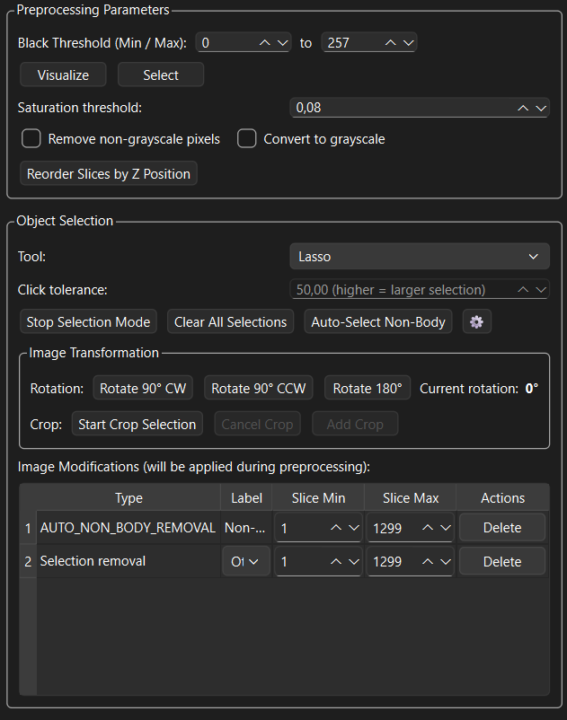
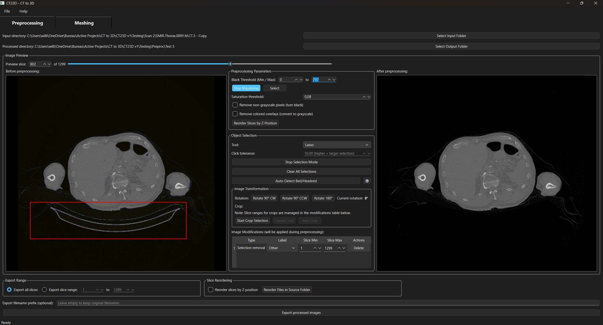
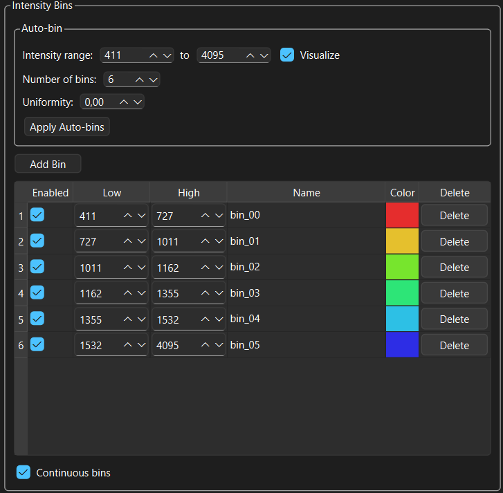
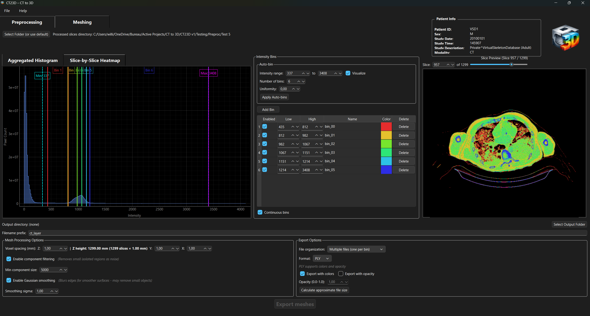
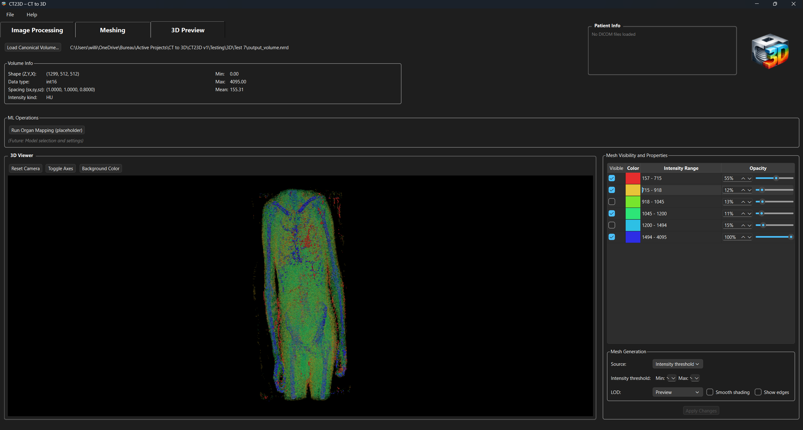

# CT23D – CT Slice to 3D Mesh Pipeline

CT23D is a modular Python application for converting stacks of CT slice images into 3D meshes.
It provides both a graphical interface and a programmatic core to preprocess CT slices, build volumetric data, analyze intensity distributions, and generate intensity-based 3D meshes.

The project is designed to be:
- Cleanly structured
- Extensible
- Usable both interactively (GUI) and headless (CLI / scripting)

---

## Features

### Image Processing (Tab 1)
- Load raw CT slice images (PNG, JPG, TIFF, DICOM, etc.)
- **Interactive object selection tools:**
  - Box selection
  - Lasso selection
  - Click-to-select with hover highlighting
  - Configurable selection tolerance
- **Automatic bed/headrest detection:**
  - Scans from bottom upward
  - Configurable aggressivity and parameters
  - Settings dialog for fine-tuning
- **Image Transformation & Cropping:**
  - **Rotation:** 90° clockwise, 90° counter-clockwise, 180°
  - **Cropping:** Box or lasso selection with slice range specification
  - Multiple crops with different slice ranges
  - Preview transformations before processing
  - Applied to entire volume during preprocessing
- **Black Threshold (Background Removal):**
  - Min/max intensity range selection (automatically adapts for DICOM uint16 vs standard uint8)
  - Visualize pixels within threshold range
  - Add threshold selection to removal list
  - Removes pixels from all slices or specified slice ranges
- **Remove non-grayscale pixels:**
  - Configurable saturation threshold
  - Turns colored pixels black
  - Applied to all slices or specified slice ranges
- **Unified Modifications Table:**
  - Single table listing all modifications (object removals, crops, non-grayscale removal)
  - Editable slice ranges (min/max) for each modification
  - Clear indication of modification type (Crop, Selection removal, etc.)
  - All modifications applied during preprocessing
- **Slice Reordering:**
  - Automatic reordering by Z position (DICOM metadata)
  - Reorder files in source folder with sequential naming
  - Optional export prefix for sequential filenames
- **Export Range Selection:**
  - Export all slices (default)
  - Export specific slice range
  - Min/max slice selection controls
- **DICOM Support:**
  - Full DICOM file compatibility (.dcm, .dicom)
  - Preserves 16-bit intensity range (0-65535) vs standard 8-bit (0-255)
  - Automatic intensity range adaptation for all controls
  - DICOM metadata preservation during export
- **Batch processing with detailed progress:**
  - Phase-aware progress (Loading, Processing, Saving)
  - Per-phase slice counters
  - Elapsed time and time remaining
  - Cancellable operations
- Output clean, processed slices ready for meshing


*Preprocessing interface with comprehensive tools for image transformation, object selection, and parameter configuration*


*Preprocessing example showing automatic bed detection (red bounding box) and before/after comparison*

### Meshing
- Load processed slices into a 3D volume
- **Tabbed Histogram Visualization:**
  - **Aggregated Histogram:** Overall intensity distribution (Intensity vs. Pixel Count)
    - Intensity 0 pixels filtered out for cleaner visualization
    - Linear scale for accurate representation
    - Vertical bin boundary lines with labels
  - **Slice-by-Slice Heatmap:** 2D heatmap (Slice Number vs. Intensity)
    - Intensity on horizontal axis, Slice Number on vertical axis
    - Color represents pixel count (log scale for visualization)
    - Vertical bin boundary lines aligned with intensity axis
- **Interactive bin management:**
  - **Auto-bin system:** Automatic intensity bin detection with configurable parameters
    - Intensity range (min/max) that adapts to DICOM (uint16) vs standard (uint8) images
    - Configurable number of bins
    - Uniformity parameter (0-1): 1 for uniform bins, 0 for distribution-based (default: 0)
    - Visualize checkbox to show/hide intensity range lines on graphs
    - Draggable range lines on histogram and heatmap for real-time adjustment
  - Add/delete bins (per-row delete buttons)
  - Modify bin min/max values (integer intensity values, minimum 1)
  - Draggable bin boundaries on histogram with real-time updates
  - Continuous bins mode (automatically adjusts adjacent bins) - enabled by default
  - Bin colors with preview
  - Enable/disable individual bins
  - Bin limits always start at intensity 1 minimum (0 is background/air)
  - Intensity range highlighting on slice preview when visualized
- **Slice preview:**
  - Large preview with slice navigation
  - Slice selector spinbox and slider for quick navigation
  - Automatic loading when directory is selected
  - Pixels colored according to assigned bins
  - Grayscale display when no bins defined
  - Intensity range highlighting when visualized
  - Real-time updates when bin parameters change
- Automatic histogram and heatmap computation when directory is selected
- Automatic optimal bin detection from intensity distribution (3-12 bins based on data)
- Fallback to 6 uniform bins if auto-detection unavailable
- Per-bin 3D mesh generation
- Supports multiple output meshes per dataset


*Meshing interface with histogram visualization, intensity bin management, and slice preview tools*


*Meshing example showing intensity histogram analysis and slice preview with bin-colored pixels*

### Export
- **Format support:**
  - **PLY (Polygon File Format)** ✓ - Fully implemented
    - Per-vertex RGB colors
    - Per-vertex alpha channel (opacity)
    - Blender-compatible sRGB colors
  - **STL (Stereolithography)** ✓ - Fully implemented
    - Binary or ASCII format
    - Geometry only (no colors/opacity support)
    - Widely compatible with 3D software
  - **NRRD (Nearly Raw Raster Data)** ✓ - Fully implemented
    - Canonical volume format with spacing and metadata
    - Gzip compression support
    - Sidecar JSON for provenance and direction matrices
    - Compatible with 3D Preview tab for visualization
  - Other formats (OBJ, GLTF) - Planned for future
- **Export options:**
  - Single file (all bins combined) or multiple files (one per bin)
  - Export with/without colors (PLY only)
  - Export with/without opacity (PLY only)
  - Custom filename prefix
  - STL binary/ASCII format selection
  - **NRRD export:**
    - Automatic spacing from UI controls (Z, Y, X in mm)
    - Provenance metadata (source directory, timestamps, app version)
    - Intensity bin information preservation
    - Automatic data type optimization (int16 or float32)
- **Mesh Processing Options:**
  - **Component Filtering:** Remove small disconnected components (optional)
    - Configurable minimum component size
    - Helps reduce noise in meshes
  - **Gaussian Smoothing:** Smooth mesh surfaces (optional)
    - Configurable smoothing strength (sigma)
    - Creates smoother surfaces but may lose small details
  - **Spacing:** Voxel spacing in mm (Z, Y, X) - configurable per axis
    - Used for mesh generation and NRRD export
    - Z height calculation display (number of slices × Z spacing)
- **File Size Estimation:**
  - Calculate approximate file size before export
  - Shows total size in MB for all files
  - Non-blocking calculation with progress indicator
- **Progress tracking:**
  - Phase-aware progress (Building masks, Extracting meshes, Saving files, Exporting NRRD)
  - Detailed per-phase counters
  - Elapsed time and time remaining
  - File size-based progress for saving phase
  - Cancellable operations with proper cleanup

### 3D Preview (Tab 3)


*3D Preview tab with interactive mesh visualization, opacity controls, and mesh generation tools*

- **Load Canonical Volume:**
  - Load NRRD format volumes exported from the Meshing tab
  - Displays file path next to load button
  - Automatic volume metadata extraction and display
  - Background mesh generation with progress tracking
- **Volume Info Display:**
  - Read-only display of volume properties:
    - Shape (Z, Y, X dimensions)
    - Data type (int16 or float32)
    - Spacing (sx, sy, sz in mm)
    - Intensity kind (HU, HU_float, or raw)
    - Statistics: Min, Max, Mean intensity values
  - Compact 2-column layout with reduced spacing
  - All values are selectable for copy-paste
- **Mesh Generation Controls:**
  - **Source selection:** Intensity threshold or Label volume (future)
  - **Intensity threshold:** Min/Max range selection on separate line (enabled after volume load)
    - Minimum column width ensures proper value display
  - **LOD (Level of Detail):** Preview (default), Standard, or High quality
    - Preview mode for fast loading and smooth interaction
    - Standard and High modes for detailed visualization
  - **Smooth shading:** Toggle smooth surface rendering (default: off for better performance)
  - **Show edges:** Toggle edge visualization (default: off)
  - Compact 3-row layout: Source, Intensity threshold, and LOD/Shading/Edges
- **3D Viewer (PyVista):**
  - Interactive 3D mesh visualization with PyVistaQt
  - **Advanced transparency rendering:**
    - Depth peeling enabled for proper transparency handling
    - Meshes sorted by opacity (most opaque first) for correct rendering
    - Opaque meshes maintain their color at contact points with transparent meshes
  - **Viewer controls:**
    - Reset camera to default view
    - Toggle axes display
    - Change background color
  - Real-time mesh rendering with optimized performance
  - Thread-safe mesh updates during loading
  - Incremental mesh addition to prevent UI freezing
- **Mesh Visibility and Properties Panel:**
  - **Unified control panel:** Single group box containing table, mesh generation, and apply button
  - **Per-mesh controls:**
    - **Visibility checkbox:** Show/hide individual meshes (default: visible)
      - Changes apply immediately when toggled
    - **Color display:** Visual representation of bin color
    - **Intensity range:** Read-only display of min-max intensity values
    - **Opacity controls:** 
      - Spinbox (0-100%) with synchronized slider
      - Bidirectional synchronization between spinbox and slider
      - Changes tracked but not applied until "Apply Changes" is clicked
  - **Apply Changes button:**
    - Applies all pending changes when clicked:
      - Opacity modifications for all modified meshes
      - Visibility changes
      - Mesh generation parameter changes (smooth shading, show edges)
    - Progress dialog showing progress for each modified mesh
    - Thread-safe updates with proper PyVista integration
    - Button enabled only when changes are pending
  - Large, scrollable table for multiple meshes
  - Efficient layout with proper column sizing
- **ML Operations (Placeholder):**
  - Future functionality for organ mapping and ML-based operations
  - Placeholder UI for model selection and settings

### GUI
- Built with PySide6
- Fully threaded execution (no UI freezing)
- **Three main tabs:**
  - **Image Processing:** Preprocessing and image transformation
  - **Meshing:** Volume loading, histogram analysis, and mesh export
  - **3D Preview:** 3D visualization and mesh manipulation
- **Patient Info Display:**
  - Patient Info box showing DICOM metadata (patient name, ID, birth date, sex, study info)
  - Automatically updates when DICOM files are loaded
  - Positioned at top right with logo
  - Two-column layout for compact display
- **Enhanced progress dialogs:**
  - Phase-aware progress with per-phase counters
  - "Complete" indicators for finished phases
  - Independent timer (elapsed/remaining time)
  - Progress bar resets for each phase
  - Single unified progress dialog for volume loading and histogram computation
  - Relevant phase information (Loading slices, Building volume, Computing histograms, etc.)
- **Improved Tab Visibility:**
  - Larger, bolder tabs for better visibility
  - Clear separation between processing steps
- **Application Branding:**
  - Application icon (up to 1024px) for taskbar and window title
  - Logo displayed in top right corner (140px height)
- Default directory linking (preprocessing output → meshing input)
- Responsive UI with proper event processing during long operations

---

## Project Structure

```
CT23D/
├── pyproject.toml
├── README.md
│
├── scripts/
│   └── run_ct23d_gui.py
│
└── src/
    └── ct23d/
        ├── core/
        │   ├── images.py
        │   ├── preprocessing.py
        │   ├── volume.py
        │   ├── bins.py
        │   ├── meshing.py
        │   ├── export.py
        │   └── models.py
        │
        ├── gui/
        │   ├── app.py
        │   ├── main_window.py
        │   ├── status.py
        │   ├── workers.py
        │   ├── view_nrrd_dialog.py
        │   │
        │   ├── preproc/
        │   │   └── wizard.py
        │   │
        │   ├── mesher/
        │   │   ├── wizard.py
        │   │   ├── histogram_3d_view.py
        │   │   ├── histogram_tabbed_view.py
        │   │   └── slice_preview.py
        │   │
        │   └── processing3d/
        │       └── wizard.py
        │
        └── cli/
            ├── preprocess_cli.py
            └── mesh_cli.py
```


---

## Installation

### Requirements
- Python 3.10 or newer
- Conda recommended (Anaconda or Miniconda)

### Create environment
conda create -n ct23d-env python=3.10
conda activate ct23d-env

### Install CT23D
pip install -e .

This installs CT23D in editable mode so source changes are reflected immediately.

---

## Running the GUI

From the project root directory:

python scripts/run_ct23d_gui.py

---

## Image Processing Workflow

1. Open the Image Processing tab
2. Select an input directory containing raw CT slices
3. Select an output directory for processed slices
4. **Optional: Remove non-grayscale pixels** - Check the option and adjust threshold if needed
5. **Optional: Select objects to remove:**
   - Choose a tool mode (Box, Lasso, or Click to Select)
   - Select objects in the preview image
   - Assign labels to selected objects (optional)
   - Objects will be removed from all slices during preprocessing
6. **Optional: Auto-detect bed/headrest:**
   - Click "Auto-Detect Bed/Headrest" (requires bed/headrest to be at the bottom)
   - Adjust settings via the settings icon if needed
7. **Optional: Rotate images:**
   - Use rotation buttons (90° CW, 90° CCW, 180°)
   - Preview shows rotation in "After preprocessing" view
   - Rotation is applied during full preprocessing
8. Adjust preprocessing parameters if needed
9. Click "Run preprocessing"

Processed slices are written to the selected output directory. The output directory will be automatically set as the default input for the meshing tab.

---

## Meshing Workflow

1. Open the Meshing tab
2. **Select a directory containing processed slices:**
   - The preprocessing output directory is automatically set as default
   - Histogram and preview are automatically computed when a directory is selected
   - You can still select a different directory if needed
3. **Inspect the histogram:**
   - **Aggregated Histogram tab:** Overall intensity distribution
     - Intensity 0 pixels are filtered out
     - Vertical bin boundary lines show bin limits
   - **Slice-by-Slice Heatmap tab:** 2D heatmap view
     - Intensity on horizontal axis, Slice Number on vertical axis
     - Vertical bin boundary lines aligned with intensity
4. **Manage intensity bins:**
   - **Auto-bin system:** Use the Auto-bin section to automatically generate bins
     - Set intensity range (min/max) - adapts to DICOM (uint16) vs standard (uint8) images
     - Set number of bins and uniformity parameter (0-1)
     - Click "Visualize" to show/hide intensity range lines on graphs
     - Drag range lines on histogram and heatmap for real-time adjustment
     - Click "Apply" to generate bins automatically
   - Optimal bins are automatically detected from intensity distribution (3-12 bins)
   - Add/delete bins as needed (use delete button in each row)
   - Adjust bin min/max values (integers, minimum 1)
   - Drag bin boundaries on the histogram for quick adjustment
   - "Continuous bins" is enabled by default - automatically adjusts adjacent bins
   - Assign colors to bins (double-click color cell)
   - Enable/disable bins using checkboxes
   - Intensity ranges automatically adapt for DICOM (uint16) vs standard images (uint8)
5. **Preview slices:**
   - Navigate through slices using the slice selector or slider
   - Preview automatically loads when directory is selected
   - Preview shows pixels colored according to their assigned bins
   - Grayscale display when no bins are defined
   - Intensity range highlighting when visualized
   - Real-time updates when bin parameters change
6. **Configure mesh processing options (optional):**
   - Enable/disable component filtering (removes small disconnected components)
   - Adjust minimum component size
   - Enable/disable Gaussian smoothing
   - Adjust smoothing strength (sigma)
   - Set voxel spacing (Z, Y, X in mm) - used for mesh generation and NRRD export
   - Z height calculation automatically updates (number of slices × Z spacing)
7. **Configure export options:**
   - Format: PLY, STL, or NRRD
   - File organization: Single file (all bins combined) or Multiple files (one per bin)
   - Export with colors: Enable/disable per-vertex RGB colors (PLY only)
   - Export with opacity: Enable/disable per-vertex alpha channel (PLY only)
   - STL format: Binary or ASCII
   - **NRRD export:** Enable "Save canonical volume" checkbox
     - Spacing values from UI are automatically applied
     - Provenance metadata is included
     - Can be loaded in 3D Preview tab for visualization
   - Optional: Calculate approximate file size before export
8. Select an output directory
9. Set filename prefix (optional)
10. Click "Export meshes" or "Export NRRD Volume"

Each enabled bin produces a separate mesh file (or all bins combined into one file, depending on your selection). Meshes include bin colors and optional opacity as configured. NRRD volumes can be loaded in the 3D Preview tab for interactive visualization.

## 3D Preview Workflow

1. Open the 3D Preview tab
2. **Load a canonical volume:**
   - Click "Load Canonical Volume..." button
   - Select an NRRD file (exported from the Meshing tab)
   - Volume metadata is automatically displayed in the Volume Info panel
3. **View volume information:**
   - Shape, data type, spacing, intensity kind
   - Min, Max, Mean intensity statistics
   - All values are selectable for copy-paste
4. **Generate meshes:**
   - **Source:** Select "Intensity threshold" (Label volume is planned for future)
   - **Intensity threshold:** Set Min/Max values on separate line (enabled after volume load)
   - **LOD:** Choose Preview (default for fast loading), Standard, or High quality
   - **Smooth shading:** Toggle smooth surface rendering (default: off)
   - **Show edges:** Toggle edge visualization (default: off)
   - Click "Generate Mesh" button
   - Meshes are generated in background and displayed incrementally in the 3D viewer
   - No UI freezing during mesh generation
5. **Control mesh visibility:**
   - Use checkboxes in the "Visible" column to show/hide individual meshes
   - Changes apply immediately when checkbox is toggled
   - Hidden meshes are properly removed from the viewer
6. **Adjust mesh properties:**
   - **Opacity:** Use spinboxes (0-100%) or synchronized sliders for each mesh
     - Spinbox and slider are bidirectionally synchronized
     - Changes are tracked but not applied until "Apply Changes" is clicked
   - **Smooth shading:** Toggle in Mesh Generation controls
   - **Show edges:** Toggle in Mesh Generation controls
   - All changes (opacity, visibility, mesh generation parameters) wait for "Apply Changes" button
   - Click "Apply Changes" button to apply all pending modifications
   - Progress dialog shows progress for each modified mesh
   - Button is enabled only when changes are pending
7. **3D Viewer controls:**
   - **Reset Camera:** Return to default viewing angle
   - **Toggle Axes:** Show/hide coordinate axes
   - **Background Color:** Change viewer background color
   - Interactive rotation, zoom, and pan with mouse
   - Proper transparency rendering with depth peeling
   - Opaque meshes maintain their appearance when touching transparent meshes

---

## Output

### Image Processing Output
- Clean, processed slice images
- Non-grayscale pixels removed (if enabled, from specified slice ranges)
- Selected objects removed from all slices or specified slice ranges
- Rotated images (if rotation was applied)
- Cropped images (if crops were applied, preserving all pixels within crop area)
- Black threshold pixels removed (if enabled, from specified slice ranges)
- Only slices within export range are saved (if export range is specified)

### Meshing Output
- **Formats:**
  - **PLY (Polygon File Format):**
    - Per-vertex RGB colors (if enabled) - sRGB-compatible for Blender
    - Per-vertex alpha channel (if opacity enabled)
    - Binary format
  - **STL (Stereolithography):**
    - Binary or ASCII format
    - Geometry only (no colors/opacity)
  - **NRRD (Nearly Raw Raster Data):**
    - Canonical volume format with spacing metadata
    - Gzip compression (default)
    - Sidecar JSON file with provenance and direction matrices
    - Filename format: `{prefix}_volume.nrrd` (or custom path)
    - Compatible with 3D Preview tab for visualization
- **File organization:**
  - **Multiple files:** One file per enabled bin
    - PLY filename format: `{prefix}_bin_{id:02d}_{low}_{high}.ply`
    - STL filename format: `{prefix}_bin_{id:02d}_{low}_{high}.stl`
    - Example: `ct_layer_bin_01_12_85.ply` or `ct_layer_bin_01_12_85.stl`
  - **Single file:** All bins combined into one file
    - PLY filename format: `{prefix}_combined.ply`
    - STL filename format: `{prefix}_combined.stl`
    - Example: `ct_layer_combined.ply` or `ct_layer_combined.stl`
  - **NRRD:** Single volume file with all intensity data
    - Includes spacing (Z, Y, X in mm) from UI settings
    - Includes provenance metadata (source, timestamps, bins, etc.)
- **Features:**
  - Integer intensity values in filenames (for PLY/STL)
  - Component filtering applied (if enabled)
  - Gaussian smoothing applied (if enabled)
  - Spacing metadata preserved in NRRD format

---

## Design Principles

- Core logic is GUI-independent
- GUI uses background threads for all heavy operations
- Clear separation between:
  - Image I/O
  - Preprocessing
  - Volume construction
  - Histogram analysis
  - Mesh generation
- Legacy compatibility preserved through wrappers when required

---

## Development Notes

- GUI workers are QThread-based
- Progress updates are phase-aware with per-phase counters
- Histogram visualization is handled via PyQtGraph (3D heatmap)
- All pixels (including zeros) are included in histogram for accurate slice representation
- Bin boundaries are draggable on the histogram with real-time table updates
- Object selection uses connected component analysis with configurable tolerance
- Mask propagation applies selected objects to all slices at the same coordinates
- Export supports per-vertex colors and opacity in PLY format

---

## Roadmap

- Additional mesh export formats (OBJ, GLTF/GLB, FBX)
- Preset-based workflows (bone, soft tissue, etc.)
- Volume preview (orthogonal slice views) in 3D Preview tab
- Label volume support for mesh generation in 3D Preview tab
- ML-based organ mapping and segmentation in 3D Preview tab
- Batch and headless processing
- Extended documentation and examples
- Advanced mask propagation algorithms

---

## License

MIT License.
